# 🪐 Google Antigravity Workspace Template (Enterprise Edition)

Language: [English](README.md) | [中文](README_CN.md) | [Español](README_ES.md)


Welcome to the **Antigravity Workspace Template**. This is a production-grade starter kit for building autonomous agents on the Google Antigravity platform, fully compliant with **Antigravity Official Documentation**—and proudly "Anti-LangChain" thanks to its minimal, transparent architecture.


## 🌟 Project Philosophy

In an era rich with AI IDEs, I wanted to achieve an enterprise-grade architecture with just **Clone -> Rename -> Prompt**.

This project leverages the IDE's context awareness (via `.cursorrules` and `.antigravity/rules.md`) to embed a complete **Cognitive Architecture** directly into the project files.

When you open this project, your IDE is no longer just an editor; it transforms into a **"Knowledgeable" Architect**.

### Why do we need a "Thinking" Scaffold?

When using Google Antigravity or Cursor for AI development, I found a pain point:

**IDEs and models are powerful, but "empty projects" are weak.**

Every time we start a new project, we repeat boring configurations:
- "Should my code go in src or app?"
- "How do I define tool functions so Gemini recognizes them?"
- "How do I make the AI remember context?"

This repetitive labor is a waste of creativity. My ideal workflow is: **Git Clone -> IDE already knows what to do.**

So I created this project: **Antigravity Workspace Template**.

## 🧠 Core Philosophy: Artifact-First

This workspace enforces the **Artifact-First** protocol. The Agent does not just write code; it produces tangible outputs (Artifacts) for every complex task.

1. **Planning**: `artifacts/plan_[task_id].md` is created before coding.
2. **Evidence**: Logs and test outputs are saved to `artifacts/logs/`.
3. **Visuals**: UI changes generate screenshot artifacts.

## 🛸 How It Works

The agent follows a strict "Think-Act-Reflect" loop, simulating the cognitive process of Gemini 3.

```mermaid
sequenceDiagram
    participant User
    participant Agent as 🤖 GeminiAgent
    participant Memory as 🧠 Memory
    participant Tools as 🛠️ Tools
    participant Artifacts as 📂 Artifacts

    User->>Agent: "Refactor Authentication"
    activate Agent
    
    Agent->>Artifacts: Create Implementation Plan
    
    Note over Agent: <thought> Deep Think Process </thought>
    Agent->>Agent: Formulate Strategy
    
    Agent->>Tools: Execute Tool (code_edit)
    activate Tools
    Tools-->>Agent: Result
    deactivate Tools
    
    Agent->>Artifacts: Save Logs/Evidence
    
    Agent-->>User: Final Report (Walkthrough)
    deactivate Agent
```



## 🔥 Killer Features

- 🧠 **Infinite Memory Engine**: Recursive summarization automatically compresses history. Context limits are a thing of the past.
- 🛠️ **Universal Tool Protocol**: Generic ReAct pattern. Just register any Python function in `available_tools`, and the Agent learns to use it.
- ⚡️ **Gemini Native**: Optimized for Gemini 2.0 Flash's speed and function calling capabilities.
- 🔌 **External LLM (OpenAI-format)**: Call any OpenAI-compatible API via the built-in `call_openai_chat` tool (supports OpenAI/Azure/Ollama).

## 🚀 Quick Start

### Local Development
1. **Install Dependencies**:
    ```bash
    pip install -r requirements.txt
    ```
2. **Run the Agent**:
    ```bash
    python src/agent.py
    ```

### Docker Deployment
1. **Build & Run**:
    ```bash
    docker-compose up --build
    ```

## 📂 Project Structure

```
.
├── .antigravity/        # 🛸 Antigravity config/rules
├── .context/            # 📚 Knowledge base auto-injected
├── .cursorrules         # 🔎 IDE auto-load pointer
├── .github/             # ⚙️ CI/CD workflows
├── artifacts/           # 📂 Agent outputs (plans, logs, visuals)
├── scripts/             # 🧪 Demo/utility scripts
│   └── demo_tools.py
├── src/                 # 🧠 Agent source
│   ├── agent.py         # Main agent loop
│   ├── config.py        # Settings management
│   ├── mcp_client.py    # MCP integration client
│   ├── memory.py        # JSON memory manager
│   ├── swarm.py         # Swarm orchestrator
│   ├── swarm_demo.py    # Swarm interactive demo
│   ├── agents/          # Specialist agents (router/coder/reviewer/researcher)
│   │   ├── base_agent.py
│   │   ├── coder_agent.py
│   │   ├── researcher_agent.py
│   │   ├── reviewer_agent.py
│   │   └── router_agent.py
│   └── tools/           # Tool implementations
│       ├── demo_tool.py
│       ├── example_tool.py
│       ├── mcp_tools.py
│       └── openai_proxy.py
├── tests/               # ✅ Test suite
│   ├── conftest.py
│   ├── test_agent.py
│   ├── test_mcp.py
│   ├── test_memory.py
│   └── test_swarm.py
├── agent_memory.json    # Runtime memory store
├── mcp_servers.json     # MCP server configs
├── mission.md           # Agent objective
├── requirements.txt     # Python deps
├── Dockerfile           # Container build
├── docker-compose.yml   # Local dev stack
├── README.md / README_ES.md / README_CN.md
└── LICENSE
```

## 🚀 The "Zero-Config" Workflow

Stop writing long system prompts. This workspace pre-loads the AI's cognitive architecture for you.

### Step 1: Clone & Rename (The "Mold")
Treat this repository as a factory mold. Clone it, then rename the folder to your project name.
```bash
git clone https://github.com/study8677/antigravity-workspace-template.git my-agent-project
cd my-agent-project
# Now you are ready. No setup required.
```

### Step 2: The Magic Moment ⚡️
Open the folder in Cursor or Google Antigravity.
- 👀 **Watch**: The IDE automatically detects `.cursorrules`.
- 🧠 **Load**: The AI silently ingests the "Antigravity Expert" persona from `.antigravity/rules.md`.

### Step 3: Just Prompt (No Instructions Needed)
You don't need to tell the AI to "be careful" or "use the src folder". It's already brainwashed to be a Senior Engineer.

**Old Way (Manual Prompting)**:
> "Please write a snake game. Make sure to use modular code. Put files in src. Don't forget comments..."

**The Antigravity Way**:
> "Build a snake game."

The AI will automatically:
1. 🛑 **Pause**: "According to protocols, I must plan first."
2. 📄 **Document**: Generates `artifacts/plan_snake.md`.
3. 🔨 **Build**: Writes modular code into `src/game/` with full Google-style docstrings.

## 🗺️ Roadmap

- [x] **Phase 1: Foundation** (Scaffold, Config, Memory)
- [x] **Phase 2: DevOps** (Docker, CI/CD)
- [x] **Phase 3: Antigravity Compliance** (Rules, Artifacts)
- [x] **Phase 4: Advanced Memory** (Summary Buffer Implemented ✅)
- [x] **Phase 5: Cognitive Architecture** (Generic Tool Dispatch Implemented ✅)
- [x] **Phase 6: Dynamic Discovery** (Auto Tool & Context Loading ✅)
- [x] **Phase 7: Multi-Agent Swarm** (Router-Worker Orchestration ✅)
- [x] **Phase 8: MCP Integration** (Model Context Protocol ✅) - *Implemented by [@devalexanderdaza](https://github.com/devalexanderdaza)*
- [ ] **Phase 9: Enterprise Core** (The "Agent OS" Vision)
  - [ ] **Sandbox Environment**: Safe code execution (e.g., E2B or local Docker) for high-risk operations.
  - [ ] **Orchestrated Flows**: Structured, parallel execution pipelines (DAGs) for complex tasks.

## 🔌 New: MCP (Model Context Protocol) Integration

**Connect to any MCP server!** The agent now supports the [Model Context Protocol](https://modelcontextprotocol.io/), enabling seamless integration with external tools and services.

### 🌐 What is MCP?

MCP standardizes how AI apps connect to external tools and data. With MCP, your agent can:

- 🔗 Connect multiple MCP servers simultaneously.
- 🛠️ Use any tools exposed by those servers.
- 📊 Access databases, APIs, filesystems, browsers, etc.
- 🔄 Merge remote tools with local ones transparently.

### 🚀 Quick Setup

1. **Enable MCP in `.env`:**
    ```bash
    MCP_ENABLED=true
    ```
2. **Configure servers in `mcp_servers.json`:**
    ```json
    {
      "servers": [
        {
          "name": "github",
          "transport": "stdio",
          "command": "npx",
          "args": ["-y", "@modelcontextprotocol/server-github"],
          "enabled": true,
          "env": {
            "GITHUB_PERSONAL_ACCESS_TOKEN": "${GITHUB_TOKEN}"
          }
        }
      ]
    }
    ```
3. **Run the agent:**
    ```bash
    python src/agent.py
    ```

The agent will automatically:
- 🔌 Connect to configured MCP servers.
- 🔍 Discover available tools.
- 📦 Merge them with local tools.

### 🏗️ Architecture

```mermaid
graph TD
    Agent[🤖 GeminiAgent] --> LocalTools[🛠️ Local Tools]
    Agent --> MCPManager[🔌 MCP Client Manager]
    MCPManager --> Server1[📡 GitHub MCP]
    MCPManager --> Server2[📡 Database MCP]
    MCPManager --> Server3[📡 Custom MCP]
    LocalTools --> |Merged| AllTools[📦 All Available Tools]
    MCPManager --> |Merged| AllTools
```



### 📡 Supported Transports

| Transport | Description | Use Case |
|-----------|-------------|----------|
| `stdio` | Standard I/O | Local servers, CLI tools |
| `http` | Streamable HTTP | Remote servers, cloud services |
| `sse` | Server-Sent Events | Legacy HTTP servers |

### 🛠️ Built-in MCP Helper Tools

- `list_mcp_servers()` — List connected servers.
- `list_mcp_tools()` — Enumerate available tools.
- `get_mcp_tool_help("<tool>")` — Show help for a tool.
- `mcp_health_check()` — Check server health.

### 📋 Pre-configured Servers

`mcp_servers.json` ships templates for:

- 🗂️ **Filesystem**
- 🐙 **GitHub**
- 🗃️ **PostgreSQL**
- 🔍 **Brave Search**
- 💾 **Memory**
- 🌐 **Puppeteer**
- 💬 **Slack**

Enable what you need and add your API keys.

### 🔧 Creating Custom MCP Servers

Example using the [MCP Python SDK](https://github.com/modelcontextprotocol/python-sdk) with FastMCP:

```python
from mcp.server.fastmcp import FastMCP

mcp = FastMCP("My Custom Server")

@mcp.tool()
def my_custom_tool(param: str) -> str:
    """A custom tool for your agent."""
    return f"Processed: {param}"

if __name__ == "__main__":
    mcp.run()
```

Register it in `mcp_servers.json`:

```json
{
  "name": "my-server",
  "transport": "stdio",
  "command": "python",
  "args": ["path/to/my_server.py"],
  "enabled": true
}
```

## 🌐 New: External LLM (OpenAI-Compatible) Support

Use any OpenAI-format chat completion endpoint (OpenAI, Azure OpenAI, local Ollama, etc.) with a unified API.

1) Configure environment:
```bash
OPENAI_BASE_URL=https://api.openai.com/v1   # or http://localhost:11434/v1 for Ollama
OPENAI_API_KEY=sk-...                       # leave empty if not required
OPENAI_MODEL=gpt-4o-mini                    # or your preferred model
```
2) Tool: `call_openai_chat` (args: prompt, system, optional model/temperature/max_tokens).
3) Behavior: follows standard `/chat/completions`; returns first choice text or error.

## 🔥 New: True Zero-Config Tool & Context Loading

**No more manual imports.** The agent discovers and loads tools and context automatically.

### 🛠️ Auto Tool Discovery
Drop any Python file into `src/tools/` and the agent will use it immediately:

```python
# src/tools/my_custom_tool.py
def analyze_sentiment(text: str) -> str:
    """Analyzes the sentiment of given text."""
    return "Positive sentiment detected!"
```

Restart and the tool is available without touching `agent.py`.

### 📚 Auto Context Loading
Add knowledge to `.context/` and it is injected automatically:

```bash
echo "# Project Rules
Use friendly language." > .context/project_rules.md
```

The agent will follow these rules on the next run.

## 🔥 New: Multi-Agent Swarm Protocol

**Collaborate at scale.** The swarm coordinates multiple specialist agents.

### 🪐 Architecture: Router-Worker Pattern

```mermaid
graph TD
    User[User Task] --> Router[🧭 Router Agent]
    Router --> Coder[💻 Coder Agent]
    Router --> Reviewer[🔍 Reviewer Agent]
    Router --> Researcher[📚 Researcher Agent]
    Coder --> Router
    Reviewer --> Router
    Researcher --> Router
    Router --> Result[📊 Synthesized Result]
```



**Specialist Agents:**
- **Router**: Analyzes, delegates, and synthesizes.
- **Coder**: Writes clean, documented code.
- **Reviewer**: Checks quality, security, best practices.
- **Researcher**: Investigates and gathers info.

### 🚀 Usage

**Run the interactive demo:**
```bash
python -m src.swarm_demo
```

**Use in your code:**
```python
from src.swarm import SwarmOrchestrator

swarm = SwarmOrchestrator()
result = swarm.execute("Build a calculator and review it for security")
print(result)
```

**Example output:**
```
🧭 [Router] Analyzing task...
📤 [Router → Coder] Build a calculator
💻 [Coder] Creating calculator implementation...
✅ [Coder] Done!
📤 [Router → Reviewer] Review for security
🔍 [Reviewer] Analyzing code...
✅ [Reviewer] Review complete!
🎉 Task Completed!
```

## 👥 Contributors

A massive thank you to the community members who help build this project:

- [@devalexanderdaza](https://github.com/devalexanderdaza) 💻 🧠 **(First Contributor!)**
  - Implemented demo tools script and enhanced agent functionality.
  - Proposed the **"Agent OS" Roadmap** (MCP, Sandbox, Orchestration).
  - Completed the MCP integration setup.
- [@Subham-KRLX](https://github.com/Subham-KRLX) 💻
  - Added dynamic tools and context loading (Fixes #4)
  - New feature: Add multi-agent cluster protocol (Fixes #6)

**Want to contribute?** Check out our [Issues](https://github.com/study8677/antigravity-workspace-template/issues) page!

## ⭐ Star History

[](https://star-history.com/#study8677/antigravity-workspace-template&Date)

## 💡 Call for Ideas: Enterprise Core

We value **ideas** as much as code. The focus now is **Phase 9: Enterprise Core** (safe sandboxing and orchestrated flows). If you propose an adoptable architecture or design, **we'll add you as a contributor**.

Share your thoughts in the [Issues](https://github.com/study8677/antigravity-workspace-template/issues), even if you don't have time to write the implementation.
